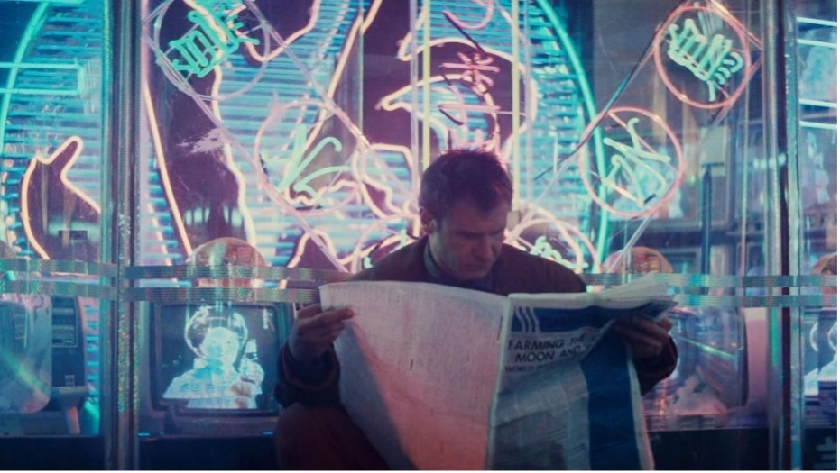
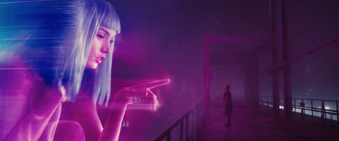
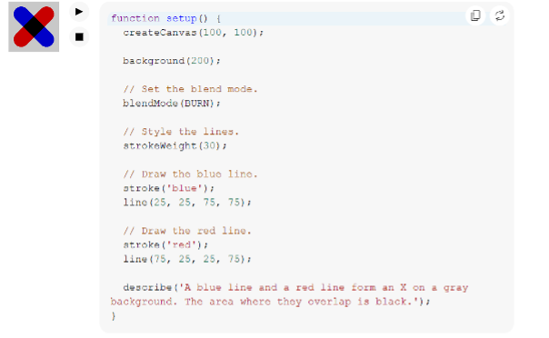

# zgao0872_9103_tut5
## Part 1: Imaging Technique Inspiration 
I found digital reflection and neon lightning inspiring techniques in the
movie Blade Runner 2049. I think it would be interesting to include the
neon lighting and reflections and include them in my project. Bright neon
colors against dark backgrounds seem a lot more prominent, making certain
parts of the design stand out. This technique also brings depth and
atmosphere; it can be further augmented with interactive features like 
transparency and reflections in the p5.js library. Considering the fact 
that the main concept of the assignment was to approach the project with 
creative coding, the given technique is useful because it can turn a simple 
image into an engaging and interactive experience, which is suitable for 
interactive and visually oriented projects. 

**Digital reflection and neon lightning Sample Images**

## Part 2: Coding Technique Exploration
filter(BLUR, radius), tint(), blendMode(ADD), These are the technique that
can be used in p5.js. The effect of glow is done in p5.js with the filter
(BLUR, radius) function that creates the effect of soft glowing light, 
which is more familiar with neon signs. Combined with blendMode(ADD) the 
lights overlap on top, and so they shine as the reflections in Blade Runner 2049. These techniques give the illusion that the scene is deeper or more 
interesting by drawing attention to the parts that matter. It makes the 
project visually attractive and creates a futuristic atmosphere due to this 
coding method, which combines light and color.

**Code Example**

**Code Link**
[Link Text](https://p5js.org/reference/p5/blendMode/)